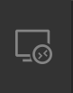
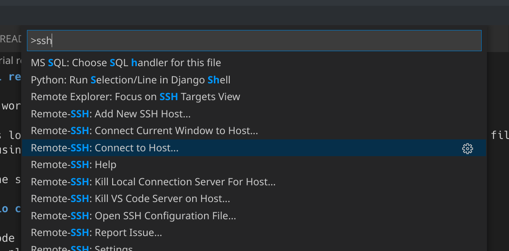
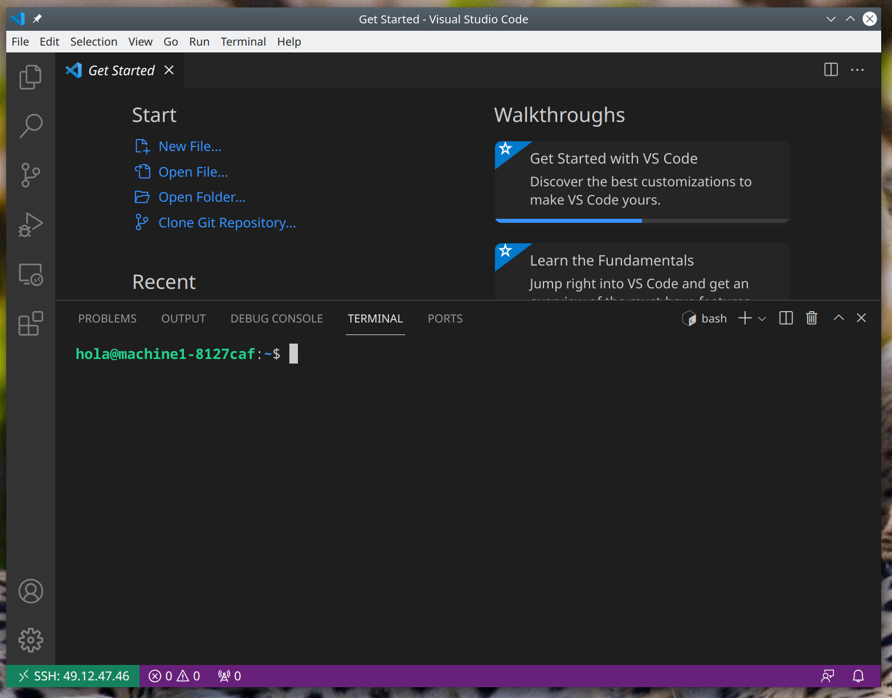
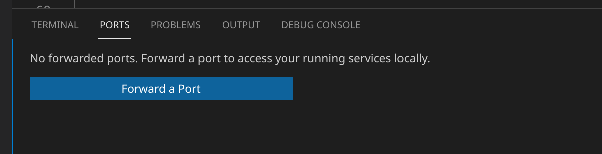
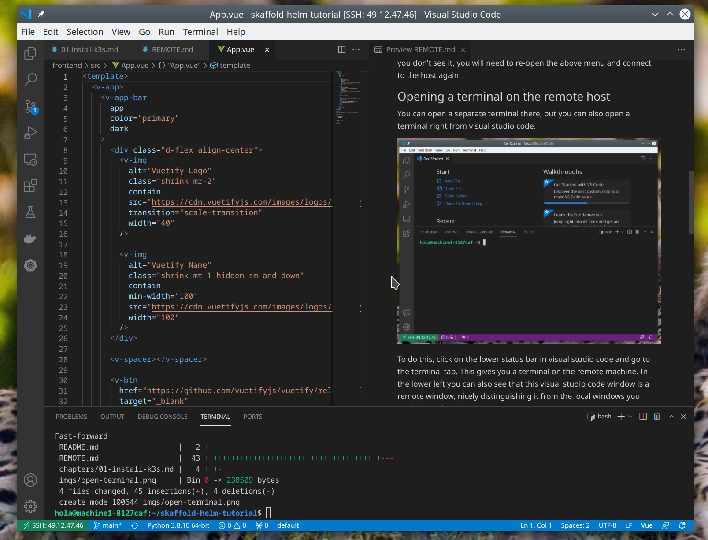

# Working on this tutorial remotely

There are two options for working remotely:

* Install all client tools locally and then copy the .kube/config from the remote host to your local filesystem. Then you can do kubernetes-related stuff locally. However, skaffold will need a docker instance running locally. So this option won't work with WSL version 1, and with WSL2 its tricky to set up.

* Work remotely complete using visual studio code.

This document describes the second option.

## Installing visual studio code

* Install visual studio code from microsoft website. its not too big so it should be quick.
* install the "remote ssh" plugin

Then make your own life comfortable and set up passwordless ssh (no idea if this works on windows):

```shell
# first run ssh-keygen if you don't have a key yet. On windows just use 'ssh-keygen' (omit the thing between square brackets)
[ -f ~/.ssh/id_rsa.pub ] || ssh-keygen
ssh-copy-id [USER]@[ip-of-remote]
```

## Connecting to the remote host

Either use the remote explorer (sidebar icon: ) or use the only shortcut you have to remember in VScode: bring the quick menu (`Ctrl-shift-P`) and:



You will first need to add the connection (`ssh [USER]@[ip-of-remote]`) to .ssh/config (follow the menu instructions). After you added the host you should see a 'connect' button appear in the lower right. If you don't see it, you will need to re-open the above menu and connect to the host again.

## Opening a terminal on the remote host

You can open a separate terminal there, but you can also open a terminal right from visual studio code.



To do this, click on the lower status bar in visual studio code and go to the terminal tab. This gives you a terminal on the remote machine. In the lower left you can also see that this visual studio code window is a remote window, nicely distinguishing it from the local windows you might have for other projects.

Now in this terminal type:

```shell
## let's get our tutorial
git clone https://github.com/Kapernikov/skaffold-helm-tutorial
## go into the folder of our tutorial
cd skaffold-helm-tutorial
## open this in ... visual studio code offcourse
code .
```

This should open a new window with the tutorial in it. Feel free to close the other window and open a terminal over here.


## Forwarding necessary ports

In the bottom bar, there should be a way to open terminals on the remote host now. There should be a tab "ports" where you can forward ports:



For this excercise, forward the following ports:

* 8888
* 9999

## install some extensions

Some extensions will be handy for this tutorial:

* **Markdown all in one** this will enable you to open these documents directly in vscode with a nice preview (control-shift-P, then type 'markdown' and choose open preview to the side)
* **python** (the official one from microsoft), obviously. intellisense and more.
* **vue** (from jcbuisson), we have a small frontend excercise in vue.
* **vetur** intellisense for vue.
* **docker** edit dockerfiles and also browse your local docker server using the icon in the left bar
* **kubernetes** will have some syntax for yaml files for kubernetes, but also it allows you to browse your kubernetes cluster once its up and running (you might need to reopen visual studio code if you installed this extension before installing kubernetes)
* **Git lens** vscode comes with basic git support baked in, but git lens gives you some more advanced features. For today you won't need it, but you might later.

Note that you might already have some of these on your local system, but we are working remotely now. The extensions need to be installed on the remote machine.

After completing the setup, your environment should look more or less like this:


