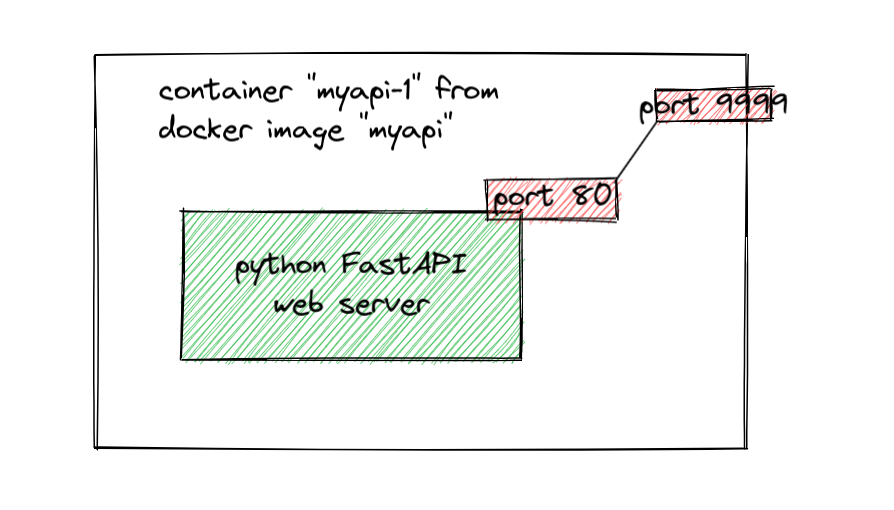
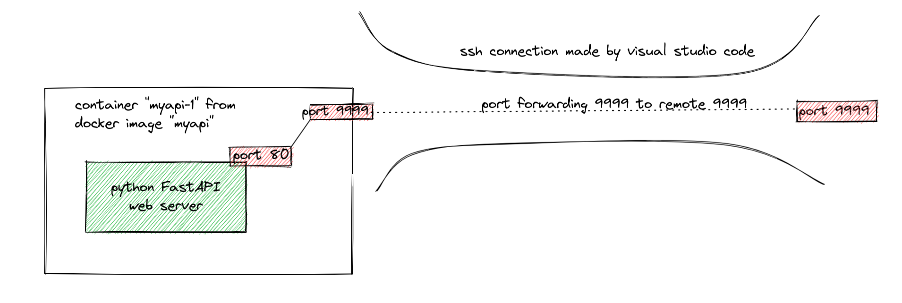

# Creating a docker image for running the backend application

Let's start by looking at our python backend application! It is a python application with a `setup.py` install script.
It also already includes a startup script, which should run once you installed all dependencies.

However, we want to run it on kubernetes, and for this to be possible, it needs to be in a docker image.
We build docker images by creating a Dockerfile that describes the steps docker should take to start from a base image (eg here ubuntu:20.04) to get the docker image we want.

Let's create a file called `Dockerfile` in a folder `myapi/docker` (to be created).

```Dockerfile
## We start from a recent ubuntu LTS release
FROM ubuntu:20.04
## let's add the source code in here
COPY . /testserver/
## We need python, pip package manager and uvicorn webserver
RUN apt-get -y update && apt-get -y install python3-pip uvicorn
## Now let's install the requirements of our little application
WORKDIR /testserver
RUN pip3 install -e .
## And let's specify a startup command for docker containers based on this image.
CMD ["sh", "start.sh"]
```

Now we can build the docker image!

```shell
cd myapi
## -t myapi means "we will call our docker image myapi"
## -f docker/Dockerfile : the dockerfile to use
## "." --> the current working directory is the context for our docker system. the whole context is sent to the docker server. The server can take no files outside of the context.
docker build -t myapi -f docker/Dockerfile .
```

> What happens when we change python code and rebuild the docker image. **Can we make this more efficient ?** If you don't get this question, head over [here](https://www.baeldung.com/linux/docker-build-cache) and read that article. 
> If you think you can do it, try to add another endpoint `/health` to the backend application that just returns 'okay'

We can now try to launch a container!

```shell
docker run -p 9999:80 -it --rm myapi
```

Now head over to http://localhost:9999/time !

## Making our docker image (even) more efficient.

Now we still have a problem: `pip` always installs our dependencies when doing pip install. This is wasted bandwidth, we almost never want to change dependencies, but we want to change source code very frequently. Now this will download our dependencies over and over again. We will use a little trick to avoid this step:

```Dockerfile
FROM ubuntu:20.04
RUN apt-get -y update && apt-get -y install python3-pip uvicorn
COPY setup.py README.md /testserver/
WORKDIR /testserver
RUN pip3 install -e .
COPY . /testserver
RUN pip3 install -e .
CMD ["sh", "start.sh"]
```

Some questions!

* Do you understand the trick we used here to make it faster ?
* Can you imagine this trick breaking down in some cases ?

## Wrapping things up

So, what did we do now ? We created a docker image that runs our webserver. This webserver runs on port 80 inside the container. We used  the `-p` option to make this internal port available as port 9999 on our system:



When we run this in a remote setup, its even a bit more complex: it still works but that's only because we forwarded the port 9999 to our local system. Visual studio code uses remote port forwarding for this:



