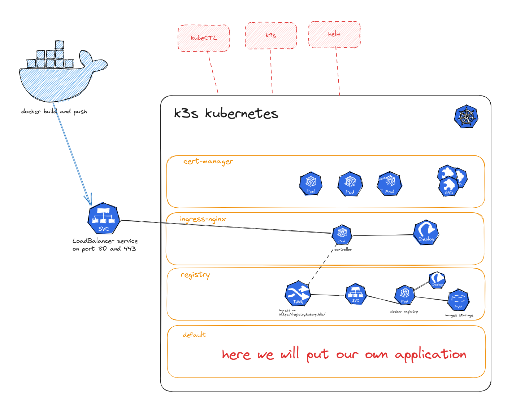

# Installing K3S

We will now install kubernetes (using k3s) on our machine. In addition to this we will install some more components:

* an **ingress controller** (here we will use nginx instead of the traefik ingress controller that comes with k3s). This will allow us to run http/https services on our cluster.
* a **docker registry**. We will build some software to run on kubernetes, and we need to store the docker images somewhere. We could use docker hub, but we will install a docker registry directly inside kubernetes. This way our docker images are very nearby and downloading them to the cluster will be super fast.
* a **certificate manager**. Networking inside our cluster is not secure. To enable https, we need a way to provide encryption certificates.

> A little warning: installing k3s adds one *node* to the cluster (your machine). This node is known by its name, which is your host name. So if you want to break your setup, by all means change your hostname after installing k3s. It would be a nice excercise to recover from the breakage introduced by changing the hostname, but that's a bit more advanced, so let's not do this now.

Here is a schema summarizing all the components we will have on our base setup. We also added to the schema where our application will stand. 



* inside k3s, each rectangle represent a **namespace**, the kubernetes ressource meant to isolate groups of resources within a single cluster

## Installing client tools

When not working on a pre-configured cloud machine, we need to install some client tools. let's not waste too much time for these, just copypaste the commands below! We will also increase some fs inotify limits so we don't run into trouble with skaffold dev

> If you use the remote environment we provided for you, these tools already come preinstalled, so you can skip straight to the next section!

```shell
curl -LO "https://dl.k8s.io/release/$(curl -L -s https://dl.k8s.io/release/stable.txt)/bin/linux/amd64/kubectl" && \
sudo install kubectl /usr/local/bin

curl https://raw.githubusercontent.com/helm/helm/master/scripts/get-helm-3 | bash

curl -Lo skaffold https://storage.googleapis.com/skaffold/releases/v1.39.3/skaffold-linux-amd64 && \
sudo install skaffold /usr/local/bin/

curl -Lo kubeseal.tgz https://github.com/bitnami-labs/sealed-secrets/releases/download/v0.17.5/kubeseal-0.17.5-linux-amd64.tar.gz && \
tar -f kubeseal.tgz -x kubeseal && sudo install kubeseal /usr/local/bin && rm -f kubeseal.tgz kubeseal

curl -Lo k9s.tgz https://github.com/derailed/k9s/releases/download/v0.26.7/k9s_Linux_x86_64.tar.gz && \
tar -xf k9s.tgz  && sudo install k9s /usr/local/bin/

curl -Lo kubectx https://github.com/ahmetb/kubectx/releases/download/v0.9.3/kubectx && \
sudo install kubectx /usr/local/bin/

cat << END | sudo tee -a /etc/sysctl.conf
fs.inotify.max_user_watches=1048576
fs.inotify.max_user_instances=1000000

END

sudo sysctl --system
```

We will also use `jq` to work with json data easily.

```shell
sudo apt install jq
```

> **_WARNING_** This tutorial assumes that you are able to access your docker server **without using sudo**. So typing `docker ps` should not give an error. If you need sudo, add yourself to the docker group (`sudo adduser $(whoami) docker`), and logout and login on your linux to update the group membership.

## Installing k3s

k3s comes with traefik ingress controller by default. We will not use this (instead we will use nginx because it’s more widely used), so we disable traefik.

```shell
## write a configfile to disable traefik
sudo mkdir -p /etc/rancher/k3s
cat << EOF | sudo tee /etc/rancher/k3s/config.yaml
disable:
    - traefik

#### DISABLE LEADER ELECTION : reduces CPU usage, but DO NOT DO THIS if you are going to run
#### a multi-node cluster!!!!
kube-controller-manager-arg:
    - "leader-elect=false"
    - "node-monitor-period=60s"

EOF
```

Note that kubernetes by default won't allow you to start containers on nodes that have less than 10% available disk space and it will even kill containers if the disk space goes below 5%. This is a nice default for most cases but in some cases, eg when you have a 1TB disk you still have enough of space at 98%.
You can (**at your own risk**) change these thresholds like so (eg to 1%):

```shell
cat << EOF | sudo tee -a /etc/rancher/k3s/config.yaml

kubelet-arg:
    - 'eviction-hard=imagefs.available<1%,nodefs.available<1%'
    - 'eviction-minimum-reclaim=imagefs.available=1%,nodefs.available=1%'
EOF
```

If you did this after installing k3s, you will need to restart k3s for these changes to take effect.

This is a config file that will be used by k3s when it starts. Now that the config file is present, k3s will use it when installed. So let's install it.

```shell
## "normal" installation
curl -sfL https://get.k3s.io | sh -
```

### Installing and running k3s in WSL

If you are running inside a WSL distribution that doesn't have systemd enabled, you will receive an error message at the end of the install:

```
System has not been booted with systemd as init system (PID 1). Can't operate.
Failed to connect to bus: Host is down
```

This is normal. Just use the start/stop scripts as explained in [README-WSL2.md](../README-WSL2.md).

### Running k3s in Linux
K3s can be started and stopped with systemd, so systemctl stop k3s will stop K3s and systemctl start k3s will start it. However, **stopping K3s will leave all containers running**. To kill all containers, run `sudo k3s-killall.sh`.

When needed, you can start k3s again by doing `sudo systemctl start k3s`.

### Configuring: kube config
Once K3s has finished startup, a file `/etc/rancher/k3s/k3s.yaml` will be created with configuration and credentials for connecting to the kubernetes cluster. This configuration is needed by all our client tools (`helm`, `kubectl`, `k9s`, ...) to make a succesfull connection to kubernetes.

The client tools typically look for a client configuration in `.kube/config` in your homedir, so let's copy the file there. We need to use sudo because by default the file is only readable by root.

```shell
mkdir -p $HOME/.kube
sudo cat /etc/rancher/k3s/k3s.yaml > $HOME/.kube/config
```

Sometimes you will have multiple clusters to manage. You will then have multiple config files. You can use the `KUBECONFIG` environment variable to tell the client tools which config file they should use. Alternatively, you can merge multiple kubeconfigs in one file. [This guide](https://stackoverflow.com/questions/46184125/how-to-merge-kubectl-config-file-with-kube-config) explains how.

Now that K3S is up and running, we are going to install some software components. We will make use of kubernetes `namespaces` to do so. We will install different software components in different namespaces. This prevents two software packages from conflicting with each other when they would have resources with the same name. It also makes for easier maintenance later on.

## Installing nginx ingress controller

We can now install the nginx ingress controller so that we can use ingresses later. There are mulitple ways of installing it, we use the [official instructions](https://kubernetes.github.io/ingress-nginx/deploy/)

```shell
helm upgrade --install ingress-nginx ingress-nginx \
  --repo https://kubernetes.github.io/ingress-nginx \
  --namespace ingress-nginx --create-namespace
```

## Installing cert-manager + a local certificate authority

We will use [Cert manager](https://cert-manager.io/) for managing certificates. We will need https certificates for the **docker registry** we will run later, because docker only allows for https registries. Note that here, we will use a self-signed certificate authority. However, setting lets-encrypt is very very simple with cert-manager if you would ever need real https certificates!

```shell
# install cert-manager 1.12.2
helm repo add jetstack https://charts.jetstack.io
helm install -n cert-manager --create-namespace cert-manager jetstack/cert-manager --set installCRDs=true
```

This is it! cert-manager is now running on your cluster. But we also need a root certificate and key so we can let cert-manager generate certificates for us.
Luckily, some openssl commands do everything that's needed:

```shell
# creating a local CA (letsencrypt won't work for localhost)
mkdir -p $HOME/kubeca && cd $HOME/kubeca
[[ -f ca.key ]] || openssl genrsa -out ca.key 2048
[[ -f ca.crt ]] || openssl req -x509 -new -nodes -key ca.key -subj "/CN=local_k3s" -days 3650 \
  -reqexts v3_req -extensions v3_ca -out ca.crt
```

Voila, this gives us:

* `ca.key` which is the private key of the root CA
* `ca.crt` which is the (self-signed) root certificate.

We will now upload these to kubernetes as a secret and tell cert-manager to use them.

```shell
## upload our key+cert
kubectl create secret tls ca-key-pair \
   --cert=ca.crt \
   --key=ca.key \
   --namespace=cert-manager
```

Now, we can create a *ClusterIssuer* which is a custom cert-manager resource that tells cert-manager how to create certificates. 
We can add more ClusterIssuers, eg one for this CA and another one for letsencrypt (look it up, its easy!). However, now we only need one.

```shell
# lets create a cluster issuer that will issue certificates using our newly created CA
cat << END | kubectl apply -f -
apiVersion: cert-manager.io/v1
kind: ClusterIssuer
metadata:
  name: selfsigned-ca-issuer
  namespace: cert-manager
spec:
  ca:
    secretName: ca-key-pair
END
```

If you get an error about an Admission Web Hook, just wait a bit and try again. cert-manager is not yet fully installed.

Since we didn't use real https certificates, our system will not trust this CA. Docker will refuse to push images to it and your browser would show a big warning when trying to surf to a website hosted on your cluster. We can fix this (at least for docker) easily by adding the CA to our local trust store.

Note that both Firefox and Google Chrome don’t look at the CA certificates data (they have their own trust store). If you want the certificate to be valid in Firefox/Chrome, you will need to take extra steps that are dependent on the browser you are using. But don't bother for now, when hosting real websites we'll switch to cert-manager anyway.

```shell
# lets make sure our computer trusts this CA!
sudo cp ca.crt /usr/local/share/ca-certificates/selfsigned-k3s.crt && sudo update-ca-certificates

# We need to restart both docker and k3s so they read the new ca-certificates trusts.
sudo systemctl restart docker
sudo systemctl restart k3s
```

### When using Docker Desktop on Windows
If you're using Docker Desktop on Windows, you need to register the certificate in Windows as well.

1. In Windows Explorer, open `\\wsl$\MyDistribution\home\MyUsername\kubeca`
2. Right-click on `ca.crt`
3. Choose "Install Certificate"
4. Choose Store Location: "Current User"
5. Place certificates in the following store: "Trusted Root Certificate Authorities"

Doc: https://docs.docker.com/registry/insecure/#use-self-signed-certificates.

## Installing docker registry

We will put our docker registry in its separate namespace, this way its easy to find it and to isolate it from the other stuff. So let's create a namespace

```shell
kubectl create namespace registry
```

As already told, docker wants https. So our docker registry will need a https certificate. We now have a working cert-managr CA so let's use it! To do this, we create a **Certificate** object. This certificate object is actually a request to cert manager to create a certificate for us. When cert-manager is done, it will store the certificate in a secret.

We can choose in what secret the certificate will be stored by specifying the `secretName` field.

```shell
# let's create a SSL certificate for our container registry
cat << END  | kubectl apply -f -
apiVersion: cert-manager.io/v1
kind: Certificate
metadata:
  name: registry-tls
  namespace: registry
spec:
  secretName: registry-tls
  issuerRef:
    name: selfsigned-ca-issuer
    kind: ClusterIssuer
  commonName: registry.kube-public
  dnsNames:
  - registry.kube-public
END
```

Now that the certificate is created, let's try to find the status:

```shell
## just get a short status
kubectl get certificate -n registry registry-tls -o wide
## or a more detailed status.
kubectl describe certificate -n registry registry-tls
```

> Note that, so far, we already learned 3 kubectl verbs: `get`, `describe` and `apply`. Do you know which one means what ? You can use these verbs with all object types known by kubernetes.

After our certificate is created, we can install a container registry. To do this, we need a hostname and an ip address that will be accessible **both from outside our cluster and from inside our cluster**. This is not so simple: we cannot use localhost or `127.0.0.1` because it doesn’t have the same meaning from outside our cluster (there it will be our pc) and inside our cluster (there it will be the current pod). So we will take the first local LAN ip address of our host. We will use /etc/hosts to make a name alias for this ip address. From then on, the registry will be accessible via `registry.kube-public`.

> **_WARNING:_** On laptops this can be problematic: there, when you connect to another wifi network, you will get another local ip address, and your /etc/hosts file will not be valid anymore. This can make you loose some time debugging since the error message might be cryptic (like “SSL verification error”) as the “old” ip might now be taken by something else.  So whenever you switch networks, check your /etc/hosts. If you use our remote environment, don't worry, the ip address won't change there!

A solution is writing a script that automates updating /etc/hosts whenever your ip changes. This is covered in the [extra chapter](99-extra-install.md#refresh-hosts)

Now that this has been taken care of, let's continue to install the container registry.
We will use helm to install it. You could also do it with plain kubectl and some yaml files, but helm will make it easier here. Don't worry about how helm works for now, we will look at it later in more detail.

```shell
# let's install the registry
### first generate a password
sudo apt-get -y -f install pwgen apache2-utils
```

```shell
export PASW=$(pwgen -1)
### then install the registry
helm repo add twuni https://helm.twun.io

export REGISTRY_HOSTNAME=registry.kube-public
helm upgrade --install --wait -n registry --create-namespace \
        registry twuni/docker-registry \
        --set ingress.enabled=true \
        --set "ingress.hosts[0]=${REGISTRY_HOSTNAME}" \
        --set "ingress.tls[0].hosts[0]=${REGISTRY_HOSTNAME}" \
        --set "ingress.tls[0].secretName=registry-tls" \
        --set persistence.enabled=true --set persistence.size=20Gi \
        --set 'ingress.annotations.nginx\.ingress\.kubernetes\.io/proxy-body-size'="5120m" \
        --set 'secrets.htpasswd'="$(htpasswd -Bbn registry $PASW)"
#### lets upload our registry password so that we can retrieve it later to create 
#### ImagePullSecrets or do docker login

kubectl apply -n registry -f - << END
apiVersion: v1
kind: Secret
metadata:
  name: registry-password
type: Opaque
stringData:
  username: registry
  password: $PASW
END


# registry.kube-public is not really a domain name, let's make it known to our machine
MYIP=$(hostname -I | cut -d' ' -f1)
echo "$MYIP ${REGISTRY_HOSTNAME}" | sudo tee -a /etc/hosts
```

When using Skaffold (later...), you will find that quickly, a lot of Docker images will pile up in your container registry, which will eat your disk space. Instead of carefully cleaning them up, we can also simply uninstall and reinstall the registry every now and then, skaffold will reupload all images if needed.

###### If everything worked fine you should be able to login with your docker now:

```shell
# here we use the '$()' syntax to take the output from a command and put it in a variable.
# we also use '|' to pass the output from one command to another
# and we use 'jq' as a json processor to take stuff out of json.
# secrets are base64 encoded to protect against accidental viewing so we need to base64 --decode them
REGPASSWORD=$(kubectl get secret -n registry registry-password -o json | jq -r '.data.password' | base64 --decode)
REGUSERNAME=$(kubectl get secret -n registry registry-password -o json | jq -r '.data.username' | base64 --decode)
REGHOST=$(kubectl get ingress -n registry registry-docker-registry -o json | jq -r '.spec.rules[0].host')
docker login -u $REGUSERNAME -p $REGPASSWORD $REGHOST
```

Your docker needs to be logged in to your registry or it won't be able to push/pull images.

if you get “login succeeded” all is fine. if you get certificate error, there are 3 possible explanations:

* the registry is using the certificate but your system doesn't trust it yet. Re-check if you did everything that should be done to add your certificates to the local trust store, including restarting docker and k3s.
* docker accesses the right IP, but the registry or the certificate is not correctly installed and docker reaches some default kubernetes "not found" page instead of the registry.
* docker is not even accessing the right IP (eg because your IP address changed or you forgot to update /etc/hosts)

Not only your docker needs to be logged in to the registry to push images, kubernetes itself will also need to log in to the registry to get images from it. This is done by adding a secret, and refering to this secret in ImagePullSecrets in a later yaml.

For instance suppose we want to create `registry-creds` secret in namespace `foo`:

```shell
export TARGET_NAMESPACE=foo
REGPASSWORD=$(kubectl get secret -n registry registry-password -o json | jq -r '.data.password' | base64 --decode)
REGUSERNAME=$(kubectl get secret -n registry registry-password -o json | jq -r '.data.username' | base64 --decode)
REGHOST=$(kubectl get ingress -n registry registry-docker-registry -o json | jq -r '.spec.rules[0].host')
kubectl create secret -n $TARGET_NAMESPACE docker-registry registry-creds \
   --docker-server=$REGHOST --docker-username=$REGUSERNAME --docker-password=$REGPASSWORD
```

> Don't do this now (it won't even work, you have no namespace `foo` yet!), but you will need it later in the next chapters.

## Playing around in our newly created kubernetes cluster

Now we will try to use kubectl to get some information out of our kubernetes cluster.

> If you work remotely, you can use kubectl in the remote session, but you could also use it locally. If you want to use local client tools with a remote kubernetes, just make sure you have the `.kube/config.yml` file in your local home directory (copy it from the remote machine). Then all commands should just work locally. You can also add the kubernetes cluster to your local lenses installation if you have the config file.

### using kubectl

OK, our kubernetes cluster is up and running and we installed some extras.
We also used `kubectl` for the first time.

Let's try if we can already look around in our cluster a bit. Here are some excercises. You should already be able to do them using what we saw so far!

* Can you try to get a list of all **namespaces** in the cluster ?
* Can you list the pods in the **registry** namespace ?
* Can you show some detailed info of the pods you just found in the **registry** namespace ?
* We created a secret in that namespace. can you find it ? can you get its yaml back ?

You will need some googling to do the following:

* Can you try to get the logs of the pod in the registry namespace ?

### Using k9s

There are multiple tools to manage a kubernetes cluster: you can use a dashboard, there is [Lens](https://k8slens.dev/) which you can install on your computer, or you can use k9s.
The nice thing of k9s is that it is very small and works over a remote ssh connection. It takes some time to get used to (less time if you already know vim) but its extremely quick once you get to know it.

We will give a quick tour of k9s, but help yourself already and look here https://k9scli.io/topics/commands/ (look at the key bindings).
Try to do the same exercises, but now using k9s.

## To go further

This chapter cover a basic setup for the utilities we will need during this workshop. For a fully functionnal environment, you would need better file handling. The [extra chapter](99-extra-install.md) covers the installation of a **storage backend** that supports shared volumes. By default k3s already installs a storage backend that just exposes some folder from the host machine. But sometimes that doesn't cut it: we could need storage volumes that can be shared by multiple pods across multiple nodes (type `ReadWriteMany`).

