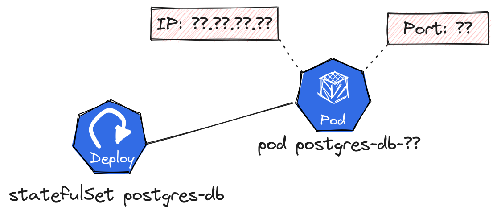
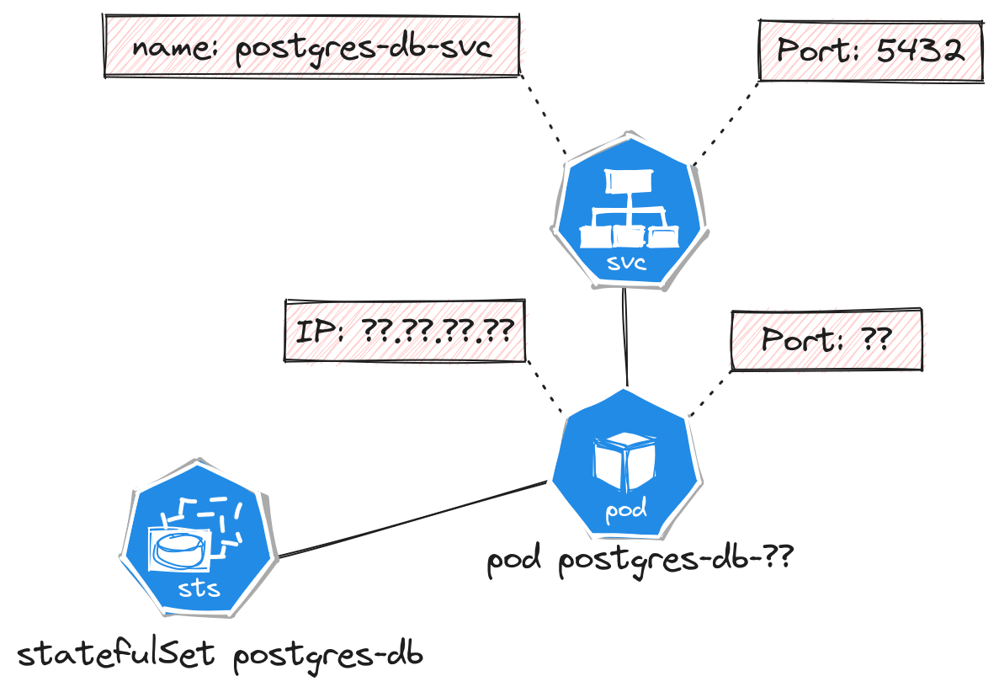

## Linking our database to our deployment through a Service

We now have multiple pods that could communicate through their ip address. let's imagine you want to connect to the database from the frontend deployment: host would require an IP adress or a name. You can retrieve the IP address of the database pod generated from the statefulset using this command:

```bash
kubectl get pod <<db-pod-name>> --template '{{printf "%s\n" .status.podIP}}'
```


Let's lookup this pod from our frontend. Open a shell in the frontend pod (using k9s or kubectl exec -it <<frontend-pod_name>> -- /bin/bash) and run the following command (replace <<db-pod-ip>> with the ip address of the database pod:

```bash
## add 
apk add postgresql-client
PGPASSWORD=astrongdatabasepassword psql -h <<db-pod-ip>> -U postgres
```

We can connect to our databases (and, for instance, with `\d`, list tables)!

Now, delete the postgresql-db-0 pod. The statefulset will automatically recreate one. But what happened to the IP address? (hint: It changes!)

The IP is randomly chosen in a range of available address. That would make things very hard, as we would need to update all the referenced ip between pods each time a pod gets restarted.



To solve this, we will use Services!

## Getting Started

let's apply the following yaml:

```yaml
apiVersion: v1
kind: Service
metadata:
  name: postgres-db
spec:
  selector:
    app: postgresql-db
  ports:
  - port: 5432
```

This will serve as the front door of a pod selected because it has a label app set as "postgresql-db". It matches the label we have set on the statefulSet! And that's not all! services can be linked to multiple pods having the same label and will in that case also be a load balancer between them. 



-> We can use name of the service as an endpoint to access the pod. Let's open a terminal in the `frontend` pod again, and do:

```bash
apk add postgresql-client
PGPASSWORD=astrongdatabasepassword psql -h postgres-db -U postgres
```

Voila!

## Wrapping up and undrestanding what happens

* Ok, next up is helm. Let's clean up and remove our deployment, statefulset and volume. We'll recreate them soon using helm. Try cleaning up the deployment using kubectl!
* Services provide reliable endpoints inside a Kubernetes cluster, but do not expose them outside of the cluster. For this, we have ingresses that will be covered later

## To go further

* We only covered the default services of type ClusterIP. Services have other types for other needs as explained in the [official documentation](https://kubernetes.io/docs/tutorials/kubernetes-basics/expose/expose-intro/).