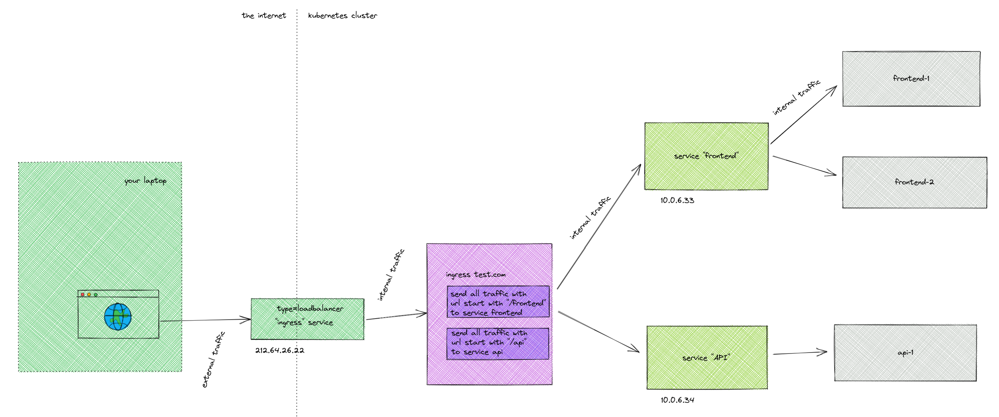

# Creating ingress for our application

Up to now, we did all development using forwarded ports. Let's make ingress rules for production.
First, head over to https://www.duckdns.org/ to get yourself a free domain name for your current ip (if you don't know your ip, its likely shown when you do `hostname -I`)

Suppose our domain name is now frank-test.duckdns.org. Let's now create an ingress yaml (we are not using https for now):

```yaml
apiVersion: networking.k8s.io/v1
kind: Ingress
metadata:
  name: myapp
  annotations:
    kubernetes.io/ingress.class: "nginx"
    nginx.ingress.kubernetes.io/use-regex: "true"
spec:
  rules:
  - host: frank-test.duckdns.org
    http:
      paths:
      - path: "/(time|settings)(.*)"
        pathType: ImplementationSpecific
        backend:
          service:
            name: api
            port:
              number: 80
      - path: "/(.*)"
        pathType: ImplementationSpecific
        backend:
          service:
            name: frontend
            port:
              number: 80
```

Questions:

* This won't work yet because the frontend won't find the backend (it tries localhost:8888 as url)
* can you try to fix it in helloworld.vue ?
* Can you make the host configurable in the helm chart ?
* Does this work with your helloworld.vue fix ?

Actually the answer to the last question is no: the helloworld.vue is only read when *building the docker image*. Which is long before it is deployed on kubernetes as part of a helm chart. So the nodeJS environment never actually sees the helm values. It is important that you understand this, fixing this is beyond the scope of this tutorial (unless you make a pull request to add it!).

Some extra's if you found this too easy:

* Try to make the ingress work with https and proper letsencrypt https certificates
* Actually fix the configurable host by using relative urls to the backend.

## Wrapping up

Let's now look on how the ingresses and the services work together:



* External traffic from the internet arrives at the kubernetes cluster at a loadbalancer service, ingress or no ingress. This is the way to have external traffic arrive to the cluster (there are some other options, but let's ignore them for now).

* The ingress controller is responsible for distributing the incoming http/https traffic to one or more internal services, based on the rules defined in **Ingress** objects. The ingress controller doesn't do load balancing, it does routing of traffic based on rules. If you want to have load balancing here, you can have more than one ingress controller pod and then the load balancer service will distribute the traffic between these pods.

* The internal services then take the traffic from the ingress controller and send them (load balancing if needed) to the right pods.

So you should really see an ingress controller as a router for traffic and **not as a loadbalancer**. It also normally only handles http/https traffic, while a service handles any kind of traffic.

Also, not all kubernetes clusters even have an ingress controller. If your kubernetes cluster doesn't have an ingress controller, you can create Ingress objects but nobody will listen for them so they will have no effect.
